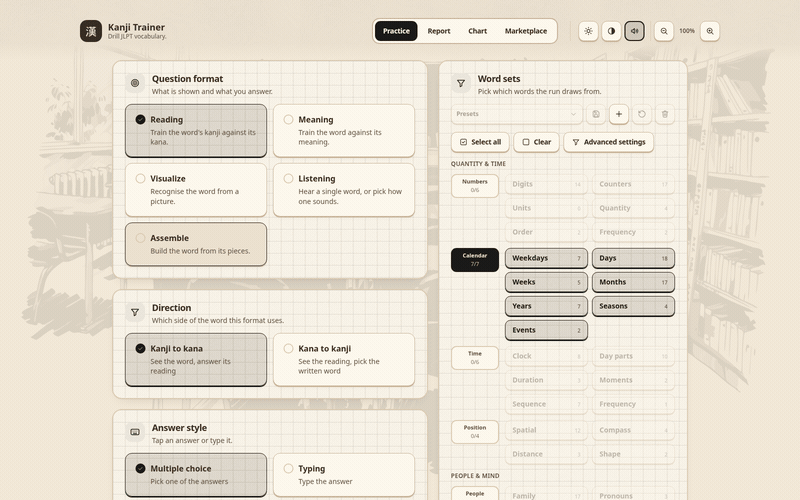
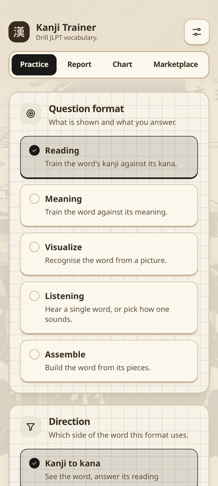

# kanji-trainer

[](https://crates.io/crates/kanji-trainer)
[](https://github.com/arsalan-anwari/kanji-trainer/releases)
[](https://github.com/arsalan-anwari/kanji-trainer/releases)
[](https://crates.io/crates/kanji-trainer)
[](https://github.com/arsalan-anwari/kanji-trainer/actions/workflows/ci.yml)
[](LICENSE)
[](https://huggingface.co/datasets/arsalan-anwari/kanji-data)
[](https://huggingface.co/datasets/arsalan-anwari/kanji-data)
[](https://arsalan-anwari.github.io/kanji-trainer/)
[]()

Trainer for JLPT vocabulary written in kanji, on desktop, tablet and phone.
Built with Tauri 2 and Svelte 5, the second app after
[kana-trainer](https://github.com/arsalan-anwari/kana-trainer).

See the [roadmap](ROADMAP.md) for planned features.

<table>
  <tr>
    <td align="center" valign="bottom">
      
    </td>
    <td align="center" valign="bottom">
      
    </td>
  </tr>
  <tr>
    <td align="center">
      <b>Desktop</b><br>
    </td>
    <td align="center">
      <b>Phone</b><br>
    </td>
  </tr>
</table>

## Features

- JLPT N5 in four packs: 715 words using 409 kanji, one picture and one recording per word
- Twelve question formats in five groups: reading, meaning, picture, listening and assembling a word from its pieces
- Answers by multiple choice or typing, typing kanji needs a Japanese IME
- Runs built by hand from sets, subcategories, word shapes and single words, at three difficulty levels that decide how look-alike the wrong answers are
- Optional time trial, per question and for the whole run
- Chart view of every word as a flip card with picture, reading, meaning and an example sentence
- Printable double-sided A4 flashcards, 1×1 to 4×4 cards per page
- Score reports saved on disk, exported and imported as `.kj-report` files
- No SRS and no review queue: the app shows your results, you decide what to practise
- Works on Linux, Windows, macOS and Android

Sentences, grammar, reading and listening comprehension belong to the planned
`jlpt-trainer`.

## Installing

<table>
  <tr>
    <td align="center"><a href="https://arsalan-anwari.github.io/kanji-trainer/"></a></td>
    <td align="center"><a href=""></a></td>
  </tr>
  <tr>
    <td align="center"><a href="https://github.com/arsalan-anwari/kanji-trainer/releases/download/v1.2.0/kanji-trainer-1.2.0-1-x86_64.pkg.tar.zst"></a></td>
    <td align="center"><a href="https://github.com/arsalan-anwari/kanji-trainer/releases/download/v1.2.0/Kanji.Trainer-1.2.0-1.x86_64.rpm"></a></td>
    <td align="center"><a href="https://github.com/arsalan-anwari/kanji-trainer/releases/download/v1.2.0/Kanji.Trainer_1.2.0_amd64.deb"></a></td>
  </tr>
  <tr>
    <td align="center"><a href="https://github.com/arsalan-anwari/kanji-trainer/releases/download/v1.2.0/Kanji.Trainer_1.2.0_universal.dmg"></a></td>
    <td align="center"><a href="https://github.com/arsalan-anwari/kanji-trainer/releases/download/v1.2.0/Kanji.Trainer_1.2.0_x64-setup.exe"></a></td>
    <td align="center"><a href="https://github.com/arsalan-anwari/kanji-trainer/releases/download/v1.2.0/kanji-trainer-1.2.0.apk"></a></td>
  </tr>
</table>

Every download is on the [releases page](https://github.com/arsalan-anwari/kanji-trainer/releases).

```sh
sudo dnf install ./Kanji.Trainer-*.rpm           # fedora, opensuse
sudo apt install ./Kanji.Trainer_*.deb           # debian 13+, ubuntu 24.04+
sudo pacman -U ./kanji-trainer-*.pkg.tar.zst     # arch
```

Or run the apk, exe or dmg with your system's installer.

### From crates.io

Needs Rust and the GTK and WebKit development headers, see
[Development](#development).

```sh
cargo install kanji-trainer
```

### Verifying a download

Every package on the releases page has two files next to it: a `.sha256`
checksum and a `.asc` OpenPGP signature by Arsalan Anwari (`arsalan-anwari`).
The checksum shows the file arrived intact, the signature that it was
published by the maintainer and nobody else.

```sh
# once: import the signing key, from github or from keys.openpgp.org
curl -sL https://github.com/arsalan-anwari.gpg | gpg --import
gpg --keyserver hkps://keys.openpgp.org --recv-keys 88A9AE5871B9A36EE3305977829EFCCDE81402E6

# for each download, next to its .asc and .sha256
sha256sum -c Kanji.Trainer_1.0.0_amd64.deb.sha256
gpg --verify Kanji.Trainer_1.0.0_amd64.deb.asc Kanji.Trainer_1.0.0_amd64.deb
```

`gpg` must print `Good signature` and the primary key fingerprint
`88A9 AE58 71B9 A36E E330  5977 829E FCCD E814 02E6`. Any other fingerprint, or
a `BAD signature`, means the file is not the one that was published: do not install it.

Each package also carries a build provenance attestation, which shows it was
built by this repository's release workflow from the tagged source:

```sh
gh attestation verify Kanji.Trainer_1.0.0_amd64.deb --repo arsalan-anwari/kanji-trainer
```

## Development

Needs Node 22+ and Rust 1.77+, plus the GTK and WebKit development headers
(same packages as [kana-trainer](https://github.com/arsalan-anwari/kana-trainer#development)).

```sh
git submodule update --init       # vendor/kaizen-ui, the UI kit
scripts/sync_data.sh --download   # data/, from Hugging Face
npm ci
npm run content:build             # data/overlay into data/packs
npm run tauri:dev                 # run the app against the vite dev server
npm run tauri:build               # release binary for this platform
npm run dev                       # vite only, browser mode
npm run check                     # svelte-check
npm test                          # unit tests
scripts/record.sh --all           # showcase stills, readme gifs and promo clip
scripts/update_version.sh 1.x.x   # set the version everywhere before tagging a release
scripts/publish.sh --dry-run      # check the crates.io package, the release publishes it
```

## Content

`data/` is not in git. It lives in the
[kanji-data](https://huggingface.co/datasets/arsalan-anwari/kanji-data) dataset on
Hugging Face, see [its README](https://huggingface.co/datasets/arsalan-anwari/kanji-data/blob/main/README.md) for the packs and
[overlay/README.md](https://huggingface.co/datasets/arsalan-anwari/kanji-data/blob/main/overlay/README.md) for the curated input.

## Licence

App code is Apache-2.0 (see [LICENSE](LICENSE)). The content in `data/` is
CC BY-SA 4.0, inherited from JMdict and KRADFILE.
